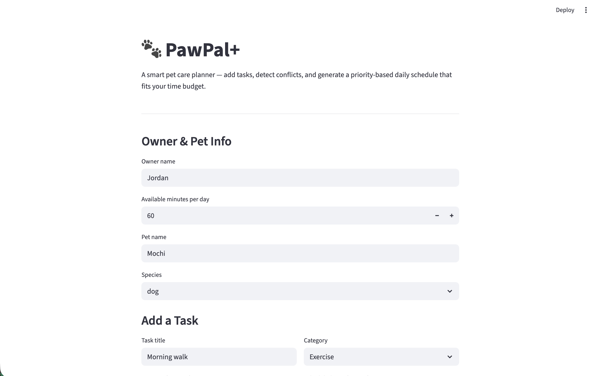

# PawPal+ (Module 2 Project)

**PawPal+** is a Streamlit-powered pet care planner that helps busy owners stay on top of walks, feedings, grooming, and more. It builds a priority-based daily schedule that fits within a configurable time budget, flags scheduling conflicts, and automatically handles recurring tasks.

## Demo

[](demo.png)

## Features

- **Priority-based daily planning** — The Planner greedily selects tasks by priority (highest first) until the owner's available minutes are exhausted, then explains what was scheduled and what was skipped.
- **Sorting by time** — Tasks are sorted by their scheduled `HH:MM` time so the daily plan reads in chronological order. Tasks without a time slot sort to the end.
- **Filtering by status or pet** — View only incomplete tasks, completed tasks, or tasks belonging to a specific pet.
- **Recurring tasks** — Tasks with a `daily` or `weekly` frequency automatically generate a new occurrence (with the correct next due date via `timedelta`) when marked complete.
- **Conflict detection** — The planner scans for overlapping time slots and surfaces `st.warning` messages so the owner can resolve collisions before generating a plan.
- **Task management** — Add tasks with category, time, duration, priority, and frequency. Edit existing tasks or mark them complete directly from the UI.

## Getting Started

### Setup

```bash
python -m venv .venv
source .venv/bin/activate  # Windows: .venv\Scripts\activate
pip install -r requirements.txt
```

### Run the app

```bash
streamlit run app.py
```

### Suggested workflow

1. Read the scenario carefully and identify requirements and edge cases.
2. Draft a UML diagram (classes, attributes, methods, relationships).
3. Convert UML into Python class stubs (no logic yet).
4. Implement scheduling logic in small increments.
5. Add tests to verify key behaviors.
6. Connect your logic to the Streamlit UI in `app.py`.
7. Refine UML so it matches what you actually built.

## Testing PawPal+

Run the full test suite with:

```bash
python -m pytest
```

For verbose output showing each test name and result:

```bash
python -m pytest -v
```

### What the tests cover

The suite contains **20 automated tests** spanning happy paths and edge cases:

- **Sorting correctness** — Tasks are returned in chronological order by scheduled time; tasks with no time sort to the end.
- **Recurrence logic** — Marking a daily task complete creates a new task for the next day; weekly tasks advance by 7 days; one-time tasks do not recur.
- **Conflict detection** — Overlapping and identical-time tasks produce warnings; non-overlapping tasks produce none; completed tasks are excluded from conflict checks.
- **Daily plan budget** — The planner selects highest-priority tasks first and never exceeds the owner's available minutes. An empty task list is handled gracefully.
- **Filtering** — `filter_by_status` correctly separates complete/incomplete tasks; `filter_by_pet` returns only the named pet's tasks and returns an empty list for unknown names.
- **Task editing and aggregation** — `CareTask.edit` updates only specified fields; `Owner.get_all_tasks` aggregates tasks across all pets; `Pet.mark_task_complete` auto-adds recurring follow-ups.

### Confidence Level

**Confidence: 5/5**

All 20 tests pass and cover the core scheduling logic, recurring task generation, conflict detection, filtering, and budget constraints. Both happy paths and meaningful edge cases (empty inputs, unknown pets, completed-task exclusion) are validated.
