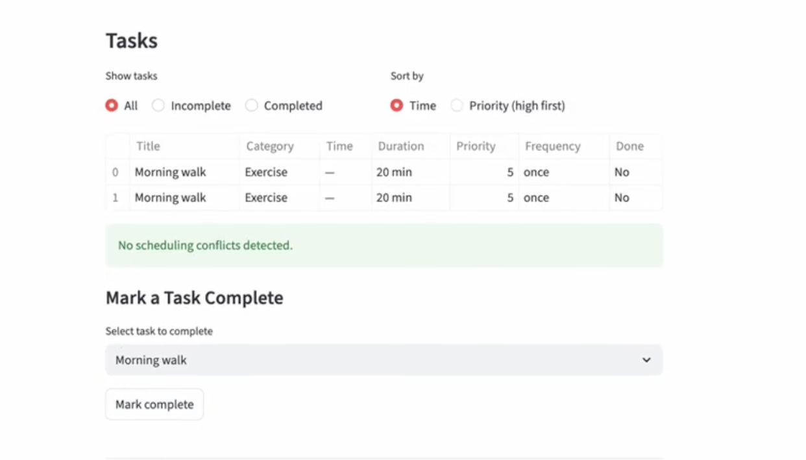
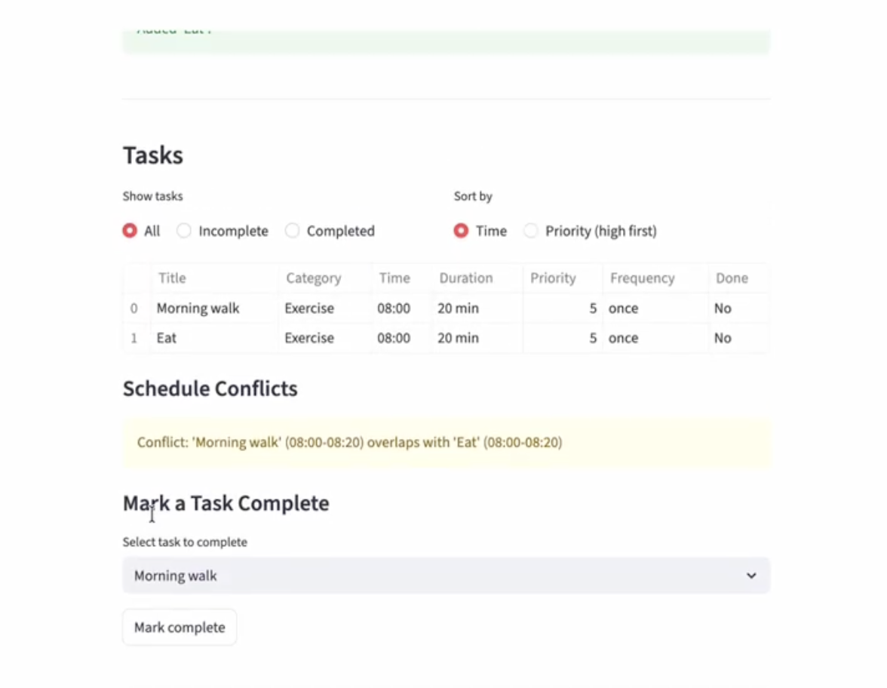
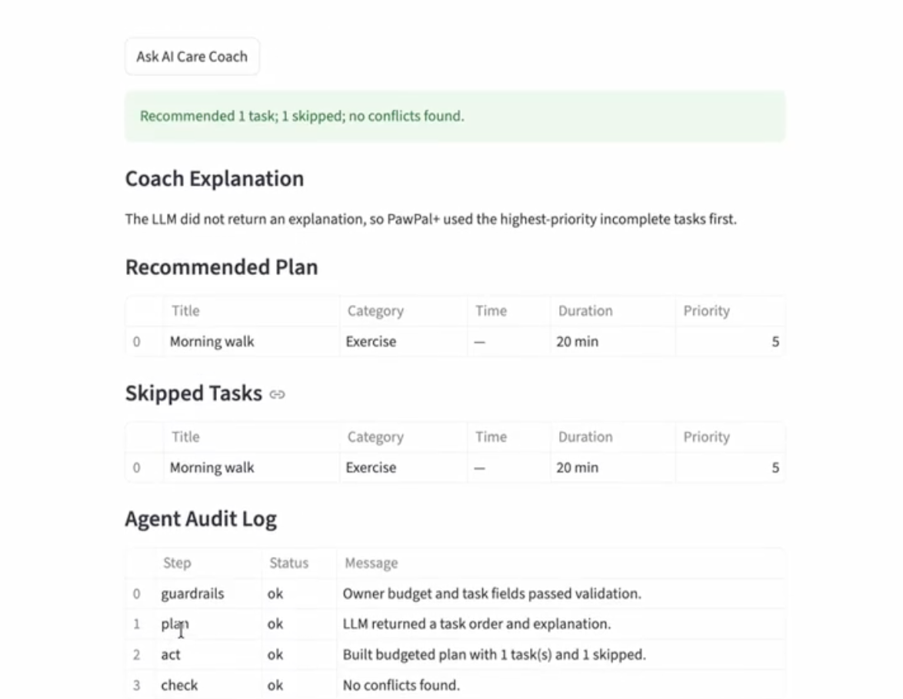
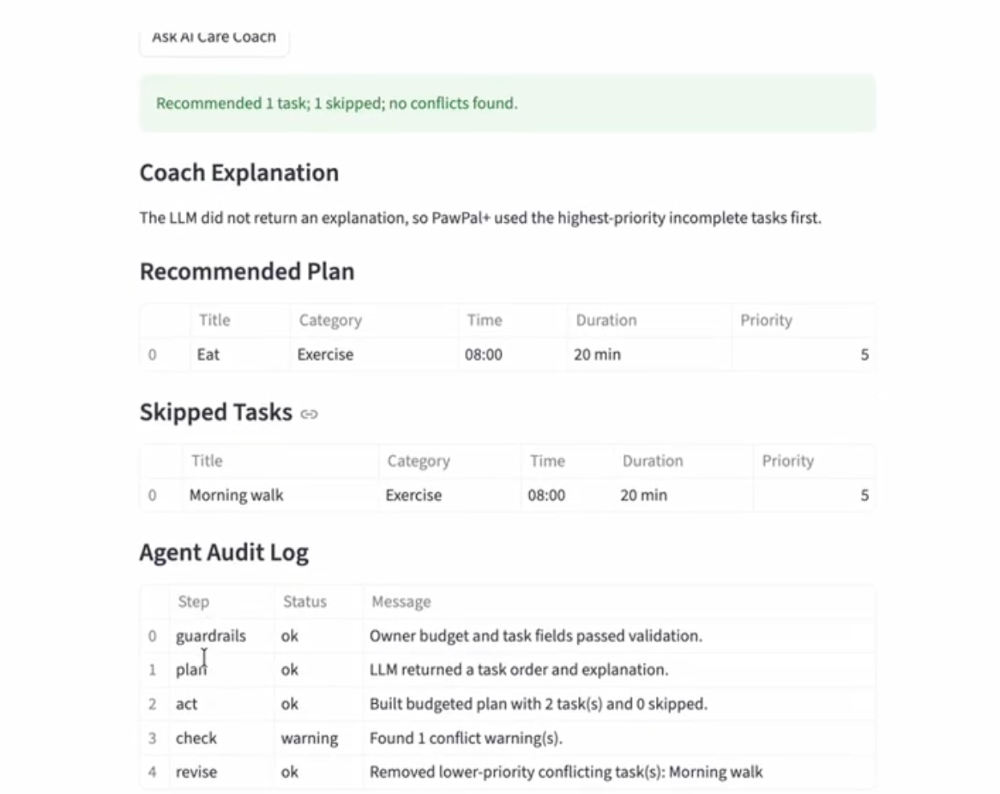
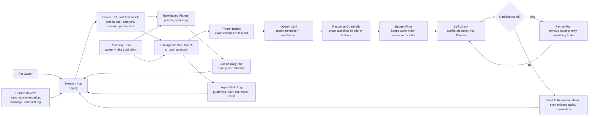

# PawPal+ Final Project

**PawPal+** is a Streamlit-powered pet care planner that helps pet owners organize daily care tasks, detect schedule conflicts, and generate a priority-based daily plan that fits within the owner's available time.

## Original Project Summary

My original project from Modules 1-3 was **PawPal+**, a pet care scheduling assistant for busy owners. Its original goal was to model owners, pets, and care tasks using object-oriented design, then use that model to create a clear daily plan based on task priority, duration, scheduled time, and the owner's available minutes. By the end of the original project, PawPal+ could add and edit pet care tasks, sort them chronologically, filter by completion status or pet, detect overlapping time slots, create recurring daily or weekly follow-up tasks, and explain why certain tasks were scheduled or skipped.

## Final Project Overview

This final project builds on the original PawPal+ system by keeping the scheduling logic separated from the user interface and presenting the planner through an interactive Streamlit app. The app lets a user manage owner and pet information, add care tasks, review filtered and sorted task lists, identify conflicts, mark tasks complete, and generate a daily schedule with a human-readable explanation.

The core logic lives in `pawpal_system.py`, while `app.py` provides the Streamlit interface. A separate `main.py` file demonstrates the same system from the command line, and the test suite verifies the planner's main behaviors.

## AI Feature: LLM Agentic Care Coach

PawPal+ includes an **LLM Agentic Care Coach**. The coach sends the current incomplete care tasks to an LLM, asks for a recommended order and short explanation, then validates the result before showing it to the user.

The feature is agentic because it follows a plan-act-check-revise loop: it asks the LLM to plan, builds a budget-safe schedule from that plan, checks the result for conflicts, revises unsafe recommendations, and displays an audit log. Python guardrails reject invalid task data, unknown task titles in structured responses, missing API configuration, and conflicting schedules that require revision.

## Demo

Video demo: [PawPal+ LLM Agentic Care Coach walkthrough](https://youtu.be/8_63EAGCJn4)

### Demo Screenshots

No-conflict task list:



Conflict detection:



AI Care Coach recommendation:



AI Care Coach conflict revision:



## Architecture Overview

The system architecture diagram is stored in `assets/system_architecture.mmd`. It shows the user entering owner, pet, and task information into the Streamlit app, which can send the same task data through two paths: the original rule-based `Planner` and the new LLM Agentic Care Coach.

The AI path builds a prompt from incomplete tasks, asks the OpenAI LLM for a recommendation and explanation, validates any structured task titles with Python guardrails, fits the ordered tasks into the owner's time budget, checks for conflicts, and revises the plan if needed. If the LLM responds in normal text instead of JSON, PawPal+ keeps the explanation and falls back to priority-based ordering for the schedule. The final recommendation, skipped tasks, explanation, and audit log return to the Streamlit UI so the human user can review the AI's reasoning before acting on it.



## Features

- **Owner and pet profiles**: Store the owner's name, daily time budget, and pet information.
- **Task management**: Add care tasks with title, category, duration, priority, time, and recurrence frequency.
- **Priority-based planning**: Selects the highest-priority tasks first while staying within the owner's available minutes.
- **LLM Agentic Care Coach**: Uses an LLM to recommend task order, then validates, revises, and logs the result with local guardrails.
- **Chronological sorting**: Displays scheduled tasks by `HH:MM` time, with unscheduled tasks moved to the end.
- **Filtering**: Shows all, incomplete, or completed tasks, and supports filtering tasks by pet in the backend.
- **Recurring tasks**: Automatically creates the next daily or weekly occurrence when a recurring task is marked complete.
- **Conflict detection**: Flags overlapping scheduled tasks before the user generates a final daily plan.
- **Plan explanation**: Explains how many minutes were used, which tasks were scheduled, and which tasks were skipped because of the time budget.

## Repository Structure

```text
.
├── ai_care_agent.py    # LLM agent workflow, guardrails, and audit logging
├── app.py              # Streamlit user interface
├── main.py             # Command-line demo
├── pawpal_system.py    # Core classes and planner logic
├── tests/              # Automated tests
├── demo.png            # App screenshot
├── reflection.md       # Project reflection
├── pawpal_uml.mmd      # UML source
├── pawpal_uml.svg      # UML diagram
├── uml_final.png       # Final UML image
└── requirements.txt    # Python dependencies
```

## Getting Started

Create and activate a virtual environment:

```bash
python -m venv .venv
source .venv/bin/activate
```

Install dependencies:

```bash
pip install -r requirements.txt
```

Create a local `.env` file:

```bash
cp .env.example .env
```

Then set your real key in `.env`:

```text
OPENAI_API_KEY=your-api-key-here
OPENAI_MODEL=gpt-5
```

Do not commit `.env`. The repository's `.gitignore` is configured to keep local secret files out of Git.

Run the Streamlit app:

```bash
streamlit run app.py
```

You can also run the command-line demo:

```bash
python main.py
```

## Design Decisions

The LLM is used for the part where natural-language reasoning is helpful: recommending an order for the day's care tasks and explaining that recommendation in a user-friendly way. The app does not let the LLM directly create or mutate tasks, because scheduling needs predictable safety checks.

Python keeps responsibility for guardrails, budget limits, conflict detection, and final validation. This design trades some LLM flexibility for reliability: the model can suggest priorities, but the code decides whether the suggestion is valid, affordable within the time budget, and safe to show.

The agent prefers structured JSON because it is easier to test and map back to real `CareTask` objects. It also accepts normal LLM text now: if the model explains the recommendation without valid JSON, the app uses that text as the explanation and falls back to the existing priority-based order for the actual schedule.

## Reliability and Evaluation

Run the full test suite:

```bash
python -m pytest
```

Run tests with verbose output:

```bash
python -m pytest -v
```

The current test suite has **35 automated tests**, and the latest local verification passed with **35/35 tests passing**. These tests cover sorting, recurring task generation, conflict detection, daily plan budget handling, task filtering, task editing, pet task aggregation, recurring follow-up creation, LLM response validation, AI guardrails, and conflict revision.

The AI tests use a fake LLM client so reliability can be checked without spending API credits or depending on a live model response. The tests verify that the agent accepts structured JSON, accepts natural-language LLM responses with a safe priority fallback, rejects unknown task titles, refuses invalid task data, avoids calling the LLM when no incomplete tasks exist, and revises conflicting schedules by removing lower-priority conflicting tasks.

The app also includes runtime reliability features: clear error handling for missing API keys, guardrail errors for unsafe inputs, and an audit log that records the agent's guardrails, planning, action, checking, and revision steps.

## Testing Summary

The most important result was that adding validation made the AI workflow more trustworthy. Without guardrails, an LLM could invent a task title or return an unusable response; with validation, those cases are rejected before they reach the schedule.

What worked well: fake LLM tests made the AI behavior reproducible, and the planner's existing conflict detection was reusable inside the agent's self-check loop. The main limitation is that live LLM quality can still vary, so the system treats the LLM as a recommender rather than the final authority and uses fallback ordering when the response is not structured.

## Reflection

This project taught me that adding AI is most useful when the AI has a clear job and the surrounding system has strong boundaries. The LLM is good at making a helpful recommendation and explanation, but the Python code is better at enforcing rules, checking conflicts, and keeping the final result safe.

The biggest design lesson was that an agentic system is more than a model call. The useful behavior comes from the loop around the model: plan, act, check, revise, log, and let a human review the result.

For a fuller discussion of limitations, misuse prevention, reliability results, and AI collaboration, see `model_card.md`.

## Confidence Level

**Confidence: 5/5**

The core scheduling logic and AI agent workflow are covered by automated tests, including happy paths and meaningful edge cases. The most important behaviors are verified: tasks are sorted correctly, recurring tasks generate the next occurrence, completed tasks are excluded from conflict checks, daily plans stay within the owner's time budget, LLM outputs are validated before use, and unsafe AI recommendations are revised or rejected.
